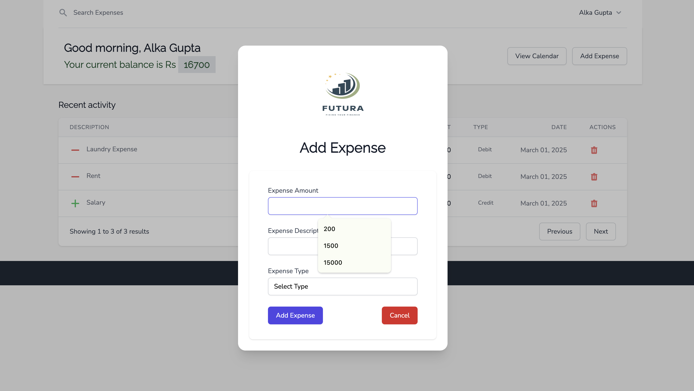
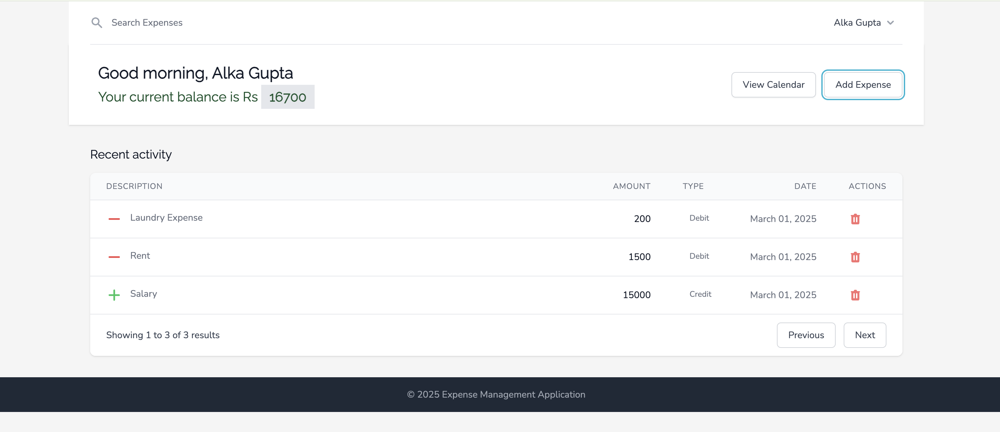
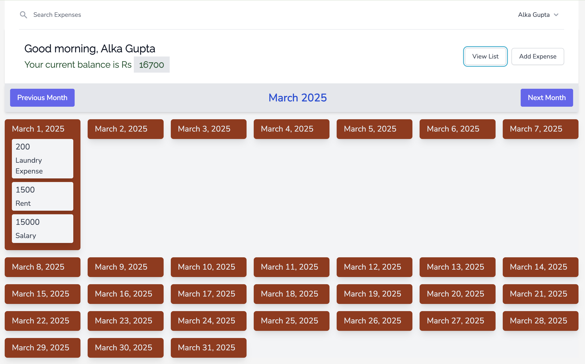

<a name="readme-top"></a>

[![Contributors][contributors-shield]][contributors-url]
[![Forks][forks-shield]][forks-url]
[![Stargazers][stars-shield]][stars-url]
[![Issues][issues-shield]][issues-url]
[![MIT License][license-shield]][license-url]
[![LinkedIn][linkedin-shield]][linkedin-url]


<!-- PROJECT LOGO -->
<br />
<div align="center">
  <a href="https://github.com/Apfirebolt/vue3_pokedex">
    
  </a>

  <h3 align="center">Expense Tracker App in Vue 3, Express, Vite using Tailwind CSS and Headless UI</h3>

  <p align="center">
    An awesome README template!
    <br />
    <a href="https://github.com/Apfirebolt/vue3_pokedex"><strong>Explore the docs »</strong></a>
    <br />
    <br />
    <a href="https://github.com/Apfirebolt/vue3_pokedex">View Demo</a>
    ·
    <a href="https://github.com/Apfirebolt/vue3_pokedex/issues">Report Bug</a>
    ·
    <a href="https://github.com/Apfirebolt/vue3_pokedex/issues">Request Feature</a>
  </p>
</div>


<!-- TABLE OF CONTENTS -->
<details>
  <summary>Table of Contents</summary>
  <ol>
    <li>
      <a href="#about-the-project">About The Project</a>
      <ul>
        <li><a href="#built-with">Built With</a></li>
      </ul>
    </li>
    <li>
      <a href="#getting-started">Getting Started</a>
      <ul>
        <li><a href="#prerequisites">Prerequisites</a></li>
        <li><a href="#installation">Installation</a></li>
      </ul>
    </li>
    <li><a href="#roadmap">Roadmap</a></li>
    <li><a href="#contributing">Contributing</a></li>
    <li><a href="#license">License</a></li>
    <li><a href="#contact">Contact</a></li>
    <li><a href="#acknowledgments">Acknowledgments</a></li>
  </ol>
</details>


<!-- ABOUT THE PROJECT -->
## About The Project

I created this project to enhance my existing knowledge in Vue 3 especially in using Composition API and Pinia data store. I used this open API which has tons of pokemon data <a href="https://pokeapi.co">https://pokeapi.co</a>

I also used Headless-UI library to add dynamic components like dropdown in this project. For browser-based testing I included Cypress library into this project.

<p align="right">(<a href="#readme-top">back to top</a>)</p>

### Built With

The project is build using Vue 3 with Vite as bundler. This uses Tailwind CSS for UI and Cypress for testing. Data is coming from PokeAPI.

* [![Vue][Vue.js]][Vue-url]
* [![Vite][Vite]][vite-url]
* [![Cypress][cypress]][cypress-url]
* [![Tailwind][Tailwind]][tailwind-url]


<p align="right">(<a href="#readme-top">back to top</a>)</p>

### Project Screenshots

This section would show the screenshots for this project. There are currently 3 images for this project inside the screenshots folder. The screenshots show the Move list page, Pokemon detail page and Move detail page.






<!-- GETTING STARTED -->
## Getting Started

This is a Vue 3 project powered by Vite. You need to have Node and npm/yarn installed on your system in order to run this project. 

### Prerequisites

Node and NPM. Some knowledge of Javascript and Vue JS would greatly help.

### Installation

Simple steps to set this thing on your system.

1. Clone the repo
   ```sh
   git clone https://github.com/Apfirebolt/vue3_pokedex.git
   ```
2. Install NPM packages
   ```sh
   npm install
   ```
3. Run the project in development mode on your system
   ```sh
   npm run dev
   ```
4. Create a production build using Vite
   ```sh
   npm run build
   ```

<p align="right">(<a href="#readme-top">back to top</a>)</p>

<!-- ROADMAP -->
## Roadmap

- [x] Project Prototyping
- [x] Creation of global components and Pages
- [x] Introduction of Pinia for store Management
- [x] Added Cypress for component testing
- [ ] Advanced Pagination
- [ ] Addition of More pages for contests, areas and more

See the [open issues](https://github.com/Apfirebolt/vue3_pokedex/issues) for a full list of proposed features (and known issues).

<p align="right">(<a href="#readme-top">back to top</a>)</p>


<!-- CONTRIBUTING -->
## Contributing

Contributions are what make the open source community such an amazing place to learn, inspire, and create. Any contributions you make are **greatly appreciated**.

If you have a suggestion that would make this better, please fork the repo and create a pull request. You can also simply open an issue with the tag "enhancement".
Don't forget to give the project a star! Thanks again!

1. Fork the Project
2. Create your Feature Branch (`git checkout -b feature/AmazingFeature`)
3. Commit your Changes (`git commit -m 'Add some AmazingFeature'`)
4. Push to the Branch (`git push origin feature/AmazingFeature`)
5. Open a Pull Request

There are a lot of API end-points like contests, areas and much more from the PokeAPI open API. There could well be separate pages for these data from the pokemon games.

<p align="right">(<a href="#readme-top">back to top</a>)</p>


<!-- LICENSE -->
## License

Distributed under the MIT License. See `LICENSE.md` for more information.

<p align="right">(<a href="#readme-top">back to top</a>)</p>


<!-- CONTACT -->
## Contact

Amit Prafulla - [@amitprafull](https://twitter.com/your_username) - aspper20@gmail.com

Project Link: [https://github.com/Apfirebolt/vue3_pokedex](https://github.com/Apfirebolt/vue3_pokedex)

<p align="right">(<a href="#readme-top">back to top</a>)</p>


<!-- ACKNOWLEDGMENTS -->
## Acknowledgments

This project owes its existance to following awesome libraries/resources.

* [Headless UI](https://headlessui.com/)
* [Img Shields](https://shields.io)
* [Tailwind UI Components](https://tailwindui.com)
* [Hero Icons](https://heroicons.com/)
* [Poke API](https://pokeapi.co/)

<p align="right">(<a href="#readme-top">back to top</a>)</p>


[contributors-shield]: https://img.shields.io/github/contributors/othneildrew/Best-README-Template.svg?style=for-the-badge
[contributors-url]: https://github.com/Apfirebolt/vue3_pokedex/graphs/contributors
[forks-shield]: https://img.shields.io/github/forks/othneildrew/Best-README-Template.svg?style=for-the-badge
[forks-url]: https://github.com/Apfirebolt/vue3_pokedex/network/members
[stars-shield]: https://img.shields.io/github/stars/othneildrew/Best-README-Template.svg?style=for-the-badge
[stars-url]: https://github.com/Apfirebolt/vue3_pokedex/stargazers
[issues-shield]: https://img.shields.io/github/issues/othneildrew/Best-README-Template.svg?style=for-the-badge
[issues-url]: https://github.com/Apfirebolt/vue3_pokedex/issues
[license-shield]: https://img.shields.io/github/license/othneildrew/Best-README-Template.svg?style=for-the-badge
[license-url]: https://github.com/Apfirebolt/vue3_pokedex/blob/master/LICENSE.txt
[linkedin-shield]: https://img.shields.io/badge/-LinkedIn-black.svg?style=for-the-badge&logo=linkedin&colorB=555
[linkedin-url]: https://linkedin.com/in/othneildrew
[Vue.js]: https://img.shields.io/badge/Vue.js-35495E?style=for-the-badge&logo=vuedotjs&logoColor=4FC08D
[Vue-url]: https://vuejs.org/
[Vite]: https://img.shields.io/badge/vite-%23646CFF.svg?style=for-the-badge&logo=vite&logoColor=white
[vite-url]: https://vitejs.dev/
[Tailwind]: https://img.shields.io/badge/tailwindcss-%2338B2AC.svg?style=for-the-badge&logo=tailwind-css&logoColor=white
[tailwind-url]: https://tailwindcss.com/
[cypress]: https://img.shields.io/badge/-cypress-%23E5E5E5?style=for-the-badge&logo=cypress&logoColor=058a5e
[cypress-url]: https://www.cypress.io/